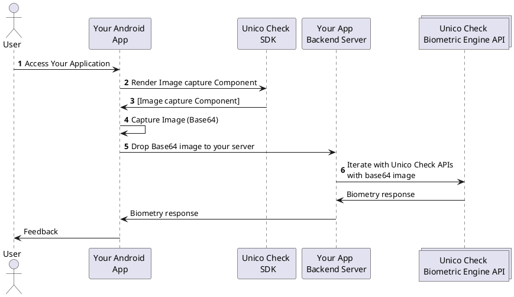

# Overview

## About this SDK

The **Unico Check** Android SDK enables you to quickly build a great experience in your native Android applications. We provide a component that allow you to frictionlessly capture images in your application through the use of modern camera opening mechanisms as well as computer vision algorithms.

Apart from abstracting all the complexity related to any device-specific nuances, our SDK also helps to correctly frame the images, optimizing its capture, aiming to increase the accuracy in the response of our biometric engine.

## Compatibility

### Supported Android versions and devices

The **Unico Check** Android SDK supports almost all devices running Android 5.0 (API level 21) and higher.

The following table lists those devices that are tested in our lab, along with vendor extensions availability. Some extensions listed may be subject to specific API levels or SKUs from the manufacturer.

| Device |	Version	| Normal	| Smart	| Type of test |
| ----------- | ------- | --------- |------ | ----------- |
| HUAWEY P30 Lite   | 9.0	| Yes	| Yes	| Device |
| ASUS_X01BDA	    | 10	| Yes	| Yes	| Device |
| Moto G4	        | 6.0.1	| Yes	| No	| Device |
| Moto G8 Power Lite | 10	| Yes	| Yes	| Device |
| Moto G7 Play | 10 | Yes	| Yes	| Device |
| Samsung Galaxy A30s SM-A307GT | 10	| Yes	| Yes	| Device |
| Redmi Note 9 | 10	| Yes	| Yes	| Device |
| ASUS_Z01KD | 8.0.1	| Yes	| Yes	| Device |
| Redmi Note 8 Pro | 10	| Yes	| Yes	| Device |
| Samsung A01 | 10	| Yes	| Yes	| Device |
| Moto G7 Power | 10	| Yes	| Yes	| Device |
| Redmi Note 9 Pro | 10	| Yes	| Yes	| Device |
| LG K22 | 10	| Yes	| Yes	| Device |
| Moto G5s Plus | 8.1.0	| Yes	| Yes	| Device |
| Samsung J8 SM-J810M | 8.1.0	| Yes	| Yes	| Device |
| Xiaomi Mi 8 Lite | 10	| Yes	| Yes	| Device |
| Galaxy A71 | 11	| Yes	| Yes	| Device |
| Galaxy S20+ | 11	| Yes	| Yes	| Device |
| Poco X3 | 10	| Yes	| Yes	| Device |
| Samsung s10e | 11	| Yes	| Yes	| Device |
| Moto G6 Play | 9	| Yes	| Yes	| Device |
| Galaxy A51 | 10	| Yes	| Yes	| Device |
| LG Q6	| 7	| Yes	| Yes	| Device |
| Redmi Note 8 | 10	| Yes	| Yes	| Device |
| Moto one macro | 10	| Yes	| Yes	| Device |
| Mi 8 Lite | 9	| Yes	| Yes	| Device |
| HUAWEY ALE-L23 | 5.0	 | Yes	| No	| Device (TestLab) |
| NEXUS 9 | 5.0.2	 | Yes	| No	| Virtual (TestLab) |
| NEXUS 4 | 5.1 | Yes	| No	| Virtual (TestLab) |
| NEXUS 7 | 5.0.2 | 	Yes	| No	| Virtual (TestLab) |
| SAMSUNG-SM-G935A | 8.0.0	 | Yes	| No	| Device (TestLab) |
| SAMSUNG-SM-G891A | 9 | Yes	| Yes	| Device (TestLab) |
| SAMSUNG SC-02J | 8.0.0 | Yes	| Yes	| Device (TestLab) |
| SAMSUNG-SM-G930AZ | 8.0.0 | Yes	| Yes	| Device (TestLab) |
| Pixel sailfish | 8.0.0 | Yes	| Yes	| Device (TestLab) |
| SAMSUNG-SM-N960N | 9 | Yes	| Yes	| Device (TestLab) |
| SAMSUNG-SM-N950N | 9 | Yes	| Yes	| Device (TestLab) |
| SAMSUNG-SM-N960U1 | 8.1.0 | Yes	| Yes	| Device (TestLab) |
| SAMSUNG-SM-N960F | 9 | Yes	| Yes	| Device (TestLab) |
| SAMSUNG-SM-N950U | 8.0.0 | Yes	| Yes	| Device (TestLab) |
| SAMSUNG-SM-G981U1 |  10 | Yes	| Yes	| Device (TestLab) |
| SAMSUNG-SM-N950F|  9 | Yes	| Yes	| Device (TestLab) |
| SAMSUNG-SM-G965N | 9 | Yes	| Yes	| Device (TestLab) |
| SAMSUNG-SM-G965U1| 8.0.0 | Yes	| Yes	| Device (TestLab) |
| SAMSUNG-SM-J727V | 8.1.0 | Yes	| Yes	| Device (TestLab) |
| HUAWEY ANE-LX-2 | 9 | Yes	| Yes	| Device (TestLab) |
| HUAWEY ANE-LX-1 | 9  | Yes	| Yes	| Device (TestLab) |
| HUAWEY MHA-L29 | 7.0  | Yes	| Yes	| Device (TestLab) |
| HUAWEY NEO-L29 | 9  | Yes	| Yes	| Device (TestLab) |
| HUAWEY COR-L29 | 8.1.0  | Yes	| Yes	| Device (TestLab) |

:::info Emulator Support

This mobile SDK is not supported by phone emulators. You will only be able to test it in real phones.

:::

## Available features

The following features are available in our SDK:

- Face Capture; 
    - Manual image capture;
    - *Smart Camera* image capture; 
    - Image capture with liveness-proven (Smartlive with interaction Facetec);
- Document Capture;

:::info Fallback to *Smart Camera mode* 

Older phones may not support some feature required by the computer vision technologies used in our *Smart Camera* feature. In these cases, the *Manual Camera* mode will be triggered as a fallback, allowing the user to manually capture his face image.

:::

## How it works

Our client-side SDK is responsible for simplifying your integration with **Unico Check**, abstracting all the complexity related to camera manipulation and image capture.

After a successful capture, our SDK will return an object that must be sent to our REST APIs in order to complete the biometric validation.

1. Users accesses your application;
2. Through our SDK, your application requests the image capture frame (as configured in your application);
3. Your application renders our image capture frame in a pre-configured placeholder;
4. Your application captures the image (automatically, manually or in *Liveness-proven* mode), generating a `JWT` token;
5. Your application sends the `JWT` to your server;
6. Your server call our REST APIs to validate the images (Documentation of our APIs can be found [at this link](https://www3.acesso.io/identity/services/v3/docs/))
7. Our server returns the biometric validation response, which is then forwarded to your application;

## Getting help

We hope this page has clarified most of your doubts. Are you missing something or still need help? Please, get in touch with our support team at our [help center](https://ajuda.unico.io/hc/pt-br/categories/360002344171).

## Next steps

- [Como Começar - Importando nosso SDK](como-comecar);
- [Guia para implantação de captura de Selfies](fluxos/captura-selfies);
- [Guia para implantação de captura de documentos](fluxos/captura-documentos);
- [Referencias do SDK](referencias);

