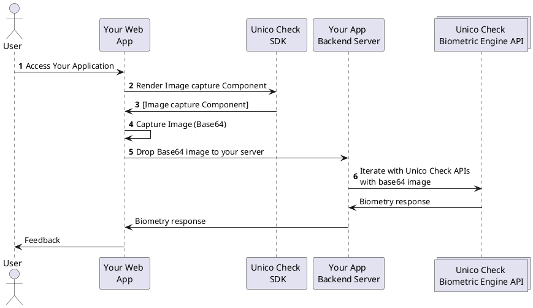

# Overview

## About this SDK

The **Unico Check** Web SDK enables you to quickly build a great experience in your native applications. We provide a component that allow you to frictionlessly capture images in your application through the use of modern camera opening mechanisms as well as computer vision algorithms.

Apart from abstracting all the complexity related to any device-specific nuances, our SDK also helps to correctly frame the images, optimizing its capture, aiming to increase the accuracy in the response of our biometric engine.

Our SDK uses native HTML 5 resources, JavaScript and CSS. It works in all modern browsers.

## Compatibility

### Operational Systems

Our capture frame supports the following OS/Versions:
- **iOS**: iOS 11.0 or higher;
- **Android**: Android 5.1 or higher;

Our Web SDK is also compatible with **Windows** e **MacOs**.

:::caution

In Web Desktop version, users might have some issues with image capture or validation due to the image quality of some VGA cameras

:::

### Browsers

Our capture frame is compatible with the following browsers/OS:

| Sistema operacional  | Chrome  | Firefox  | Opera  | Edge  | Safari |
|--------------------|---------|----------|--------|-------|--------|
| Windows (desktop)  |  |  |   |   |    |
| Android            |  |  |  |  |  |
| iOS mobile/Macbook |  |  |  |  |  |

In general, our SDK supports WebRTC and newer versions of the browsers listed above. For compatibility and security reasons, we do not guarantee compatibility on very old versions of these browsers.

:::caution Webviews or other kind of browsers

We do not support WebView or another kind of browsers (other than listed above)

:::

## Available features

The following features are available in our SDK:

- Face Capture; 
    - Manual image capture;
    - *Smart Camera* image capture; 
    - Image capture with liveness-proven (Smartlive with interaction Facetec);
- Document Capture;

:::info Fallback to *Smart Camera mode* 

Older phones may not support some feature required by the computer vision technologies used in our *Smart Camera* feature. In these cases, the *Manual Camera* mode will be triggered as a fallback, allowing the user to manually capture his face image.

This kind of fallback is not available for **Smartlive with interaction Facetec** mode.

:::

## How it works

Our client-side SDK is responsible for simplifying your integration with **Unico Check**, abstracting all the complexity related to camera manipulation and image capture.

After a successful capture, our SDK will return an object that must be sent to our REST APIs in order to complete the biometric validation.

1. Users accesses your application;
2. Through our SDK, your application requests the image capture frame (as configured in your application);
3. Your application renders our image capture frame in a pre-configured placeholder;
4. Your application captures the image (automatically, manually or in *Liveness-proven* mode), generating a `JWT` token;
5. Your application sends the `JWT` to your server;
6. Your server call our REST APIs to validate the images (Documentation of our APIs can be found [at this link](https://www3.acesso.io/identity/services/v3/docs/))
7. Our server returns the biometric validation response, which is then forwarded to your application;

## Getting help

We hope this page has clarified most of your doubts. Are you missing something or still need help? Please, get in touch with our support team at our [help center](https://ajuda.unico.io/hc/pt-br/categories/360002344171).

## Next steps

- [Como Começar - Importando nosso SDK](como-comecar);
- [Guia para implantação de captura de Selfies](fluxos/captura-selfies);
- [Guia para implantação de captura de documentos](fluxos/captura-documentos);
- [Referencias do SDK](referencias);

